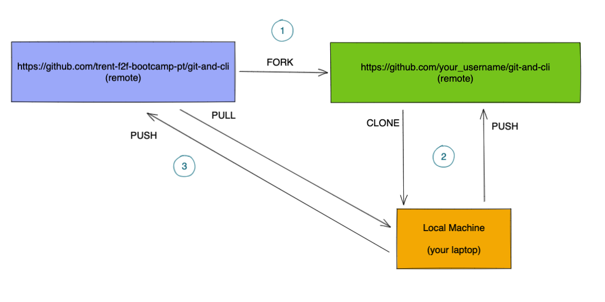
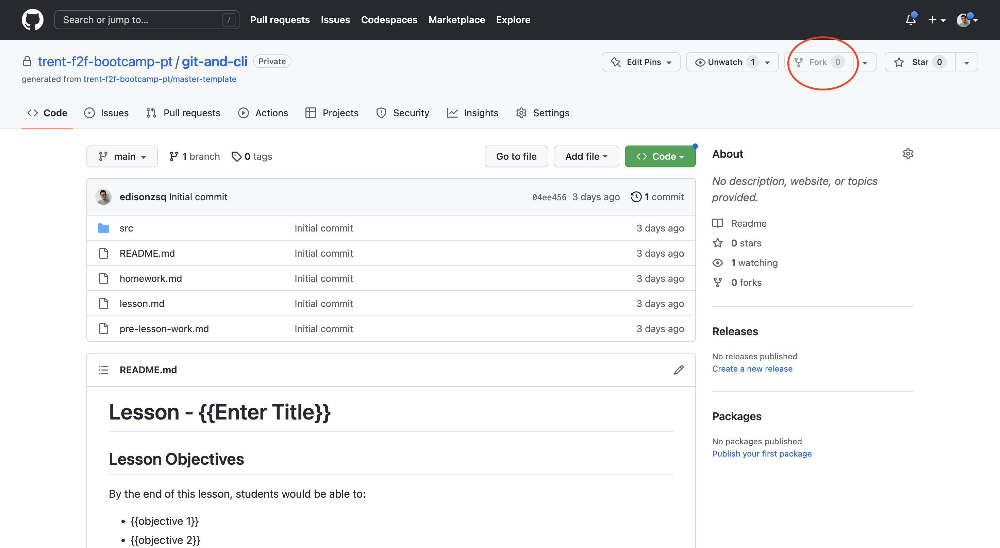
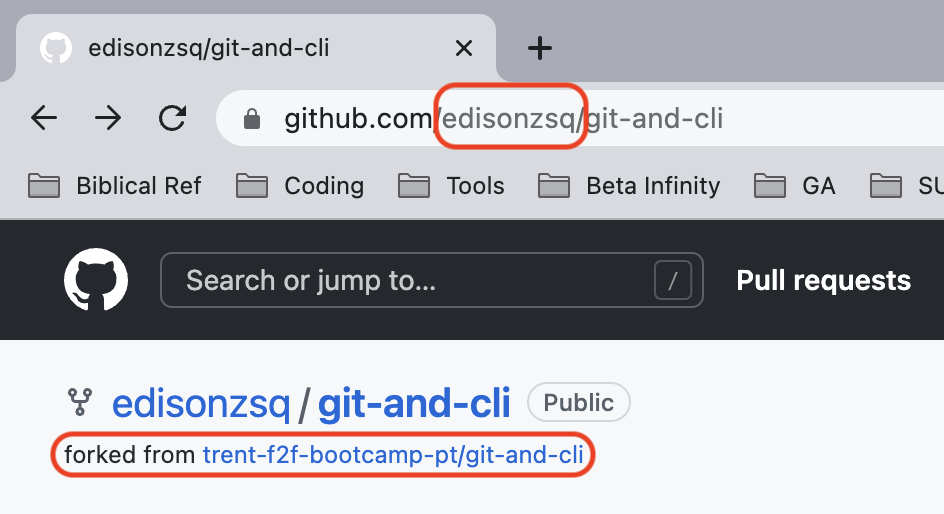
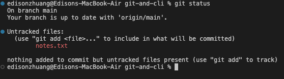
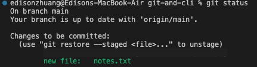
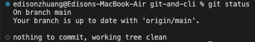

# Lesson

## Lesson Overview

Code Version Control such as GIT is a mandatory tool for developers to collaborate in building and releasing software. Without code version control, the effort to integrate codes written by multiple developers become impossible. GIT has been a popular choice and in this program, we will be using GitHub.com for all lesson content and homework submission. This will help learners to become familiarized with GIT. The mastery of GIT and the use of GitHub takes time. Learners only need to know enough to obtain lesson materials and submit homework by the end of this lesson.

---

## Part 1 - What is GIT?

### Video Introduction

[](https://youtu.be/2ReR1YJrNOM)

### Common Misconceptions

1. GIT is the Code Version Control tool. GitHub.com is a web platform that utilizes GIT. BitBucket is a GitHub competitor.
1. Repository basically means a storage space. In GIT, it is a place where we store codes and files related to software.
1. Since GIT is distributed, there is no single source of truth. But there will always be a local repository and multiple remote repositories.

**How is GIT Distributed?**



- When we FORK a repository shown at (1), we are copying a repository from one source (other account) into our own account.
- In most cases, we would clone from the repository resides in our own account as shown at (2). Clone means to make a copy from our remote repository (in GitHub) to our local machine.
- The repository in our local machine and our remote repository will be linked. By default, the link alias is named `origin`.
- We can also create additional link shown as (3). We can add a new remote link alias to the upstream remote repository we forked from. 

> A "link" is a layman term to help learners better understand. The technical term is [tracked remote repository](https://git-scm.com/docs/git-remote).


### Steps for Homework

Every lesson would require learners to:

1. `Fork` repository from Trent's to personal 
1. `Clone` from personal remote repository to local machine
1. Make changes to the repository (such as doing homework)
1. Stage the changes by using `add` command
1. Commit the staged changes by using `commit` command
1. Finally, push the commit to personal remote repository using the `push` command

With this, instructors will be able to receive learners' homework on their GitHub repositories.

---

## Part 2 - Forking & Cloning Repositories

Step 1: Visit the lesson URL: https://github.com/trent-f2f-bootcamp-pt/git-and-cli

Step 2: Fork the repository



Step 3: Verify that the repository is forked




---

## Part 3 - Commit Changes and Push Commits

**Step 1: Decide on a directory to store all your lesson repositories**

Recommendations depending on your setup...

Windows User: `C:\Users\<your username>\Trent` or `D:\Trent`

MacOS User: `~/Trent` or `/Users/<your username>/Trent`


**Step 2: Change Directory to `Trent` folder**

```sh
cd ~/Trent # replace the path with your actual directory
```

**Step 3: Clone the repository**

```sh
git clone https://github.com/your_username/git-and-cli # replace your_username 
``` 

**Step 4: Change Directory to the Repository cloned**

```sh
cd git-and-cli
```

**Step 5: Launch VS Code for that repository**

Command Line:
```sh
code .
```

**Step 6: Make changes**

Add a new file `notes.txt` and write `The quick brown fox jumps over the lazy dog` as conent.

**Step 7: Commit changes**

Once changes are made, use `git status` command and you will observed a new file is added.



Now, let's stage this file by using the `git add` command.

```sh
git add . 
```

or

```sh
git add notes.txt
```

- `.` refers to the current directory while specifying `notes.txt` will add the specific file.

```sh
git add notes.*
```

- You can also use the wildcard (*) to add multiple files that starts with `notes.` in this case.

After `git add`, perform `git status` to check that the file is added.



- You'll notice the notes.txt has turned to green color with a prefix `new file:`

Now, perform `git commit` to commit the change to the local repository.

```sh
git commit -m "enter a meaning commit summary" # such as "added notes.txt file"
```

Use `git status` to check if the file is committed



- it says "nothing to commit" and hence all files are commited

**Step 8: Push commit**

```sh
git push origin main
```

- `origin` refers to the link to the remote repository that you cloned from. Run `git remote -v` to check it out.
- `main` is the default branch. All repository starts from `main`. (In older version of GIT, default branch is `master`)

**Step 9: Verify changes are pushed*

Go to `https://github.com/your_username/git-and-cli` to verify that `notes.txt` file is present.

END
